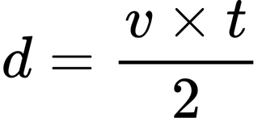
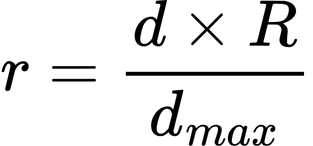
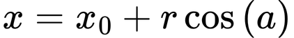
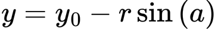

# Radarly
Radarly is an arduino radar created for one of my assignments in physics class. Its purpose was to demonstrate how the reflected ultrasonic sounds can allow us to measure the distance between a **source** *(the arduino sensor)* and an **object**.

## App Preview
Here is the interface of the application:


## Tech Stack
In order to implement this app, i've used the following tech stack: <br>
**Frontend** <br>
- Pygame (Python library)

**Backend** <br>
- Serial (Python library)
- Math, deque (Standard py libraries)
- Arduino Servo Library <br>

**Languages** <br>
- Python
- C++ (ino)

## Setting up the project
In order to run the project on your local machine, you'll first need to clone it:
```bash
git clone https://github.com/Sank34/radarly.git
```
Inside the **interface** directory you'll find the python script. You can configure your variables or leave it as is.
- ``PORT``: your serial communication port.
- ``BAUD``: do NOT modify, it's the serial communication frequency.
- ``WIDTH; HEIGHT``: the resolution of your radar's window.
- ``FPS``: the refresh rate of your radar's window.
- ``MAX_CM``: the maximum width of your radar. Keep in mind that the HC-SR04 can measure up to 400 cm, so that's the maximum value. (Recommended to not modify it over 100 cm)
- ``SWEEP_WIDTH``: the width of your radar's sweep.
- ``POINT_MEMORY``: how many points the radar should keep in memory (aka how fast they dissapear).

Now let's setup the hardware! Here is the hardware's diagram:


You'll find the arduino code inside the **arduino** directory. You shouldn't modify anything, except if you have a different hardware setup for your desired ports.

Now you can upload the code on your arduino UNO/NANO board, run the python app and see the magic happen!

## The system
Ofcourse, in order to make this app work we've had to use some formulas.

**The Algorithm** <br>
*HC-SR04 sensor -> Arduino board* - data is transmited from the sensor and read using the arduino board. <br>
*Arduino board -> Serial -> Python App* - after the data has been read by the board, it's transmited via the Serial Communication Band to the python script. <br>
*Python App -> UI* - the data sent by the arduino board is processed by the python script, carefully calculating what it needs to display.

## How does it work?
Ofcourse , in order to make the project run we've had to come up with some formulas. Here you'll find each formula we have used in this project:

**1. Calculating the distance between the senzor and the object**

 <br>
- **v** - represents the speed of air particles.
- **t** - the time it took for the sound wave to get to the object and back.

**2. Scaling the distance & calculating the graphical radius**

 <br>
- **R** - represents the graphical radius
- **d** - the actual (real) distance
- **Dmax** - the maximum distance wanted

Note that the radius is calculated like this:
```python
radius = min(WIDTH//2 - 40, HEIGHT - 80) 
```
This formula gets the minimum between the center of the screen (-40px to leave some additional space for the UI) and the height of the screen (-80px -> 40 down and 40 up).

**3. Converting polar coordinates to cartesian coordinates** <br>
 In order to find the coordinates on screen for the points, we're using these 2 formulas to find the *(x,y)* point:

  <br>
  <br>

 - **r** - the scaled distance <br>
 - **alpha(a)** - servo angle <br>
 - **(x0,y0)** - the center of the screen

 ## Contributing
 If you would like to contribute to the project, you can clone it, set it up and if you would like to add another feature just create a pull request and i'll review it. Feel free to use this project and expand it further! :)
 
